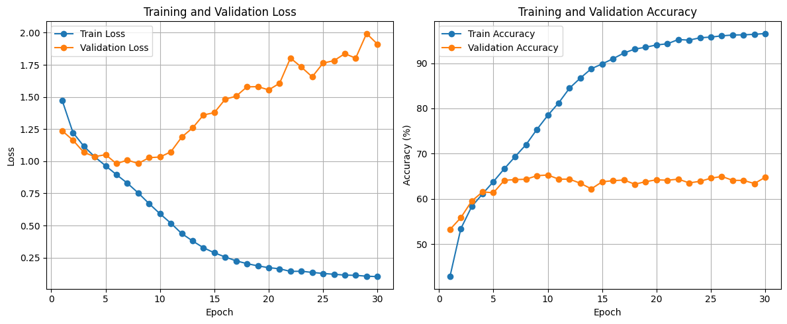

# Facial Emotion Detection 


# Finetuning YOLO-V8 
Facial emotion detection using YOLO-V8.
This data does not have sufficient amount of images for training a robust model. The model is overfitted to the training data and does not generalize well to unseen data, according to the train/test loss and accuracy curves.


## Installation
1. Clone the repository:
   ```bash
   git clone
   cd mood-recognition/yolo_overfitted
   ```
2. Create and activate a virtual environment (optional but recommended):
   ```bash
   python -m venv .venv
    source .venv/bin/activate  # On Windows use `.venv\Scripts\activate`
    ```
3. Install the required packages:
    ```bash
    pip install -r requirements.txt
    ```
4. Download the dataset from kaggle:
    ```bash
    curl -L -o ./data/train/face-expression-recognition-dataset.zip\
    https://www.kaggle.com/api/v1/datasets/download/jonathanoheix/face-expression-recognition-dataset
    unzip ./data/train/face-expression-recognition-dataset.zip -d ./
    ```
   Alternatively, you can download the dataset manually:

   - Create a Kaggle account if you don't have one.
   - Go to the dataset page: https://www.kaggle.com/datasets/jonathanoheix/face-expression-recognition-dataset
   - Click on "Download" to get the dataset.
   - Unzip the downloaded file and place it in the `images/` directory.

